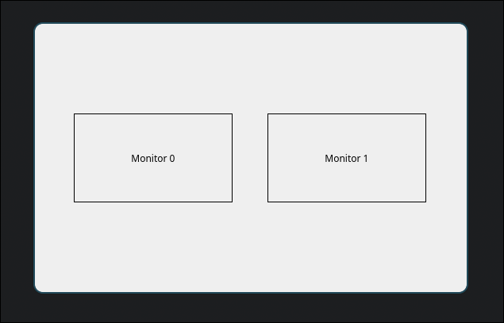
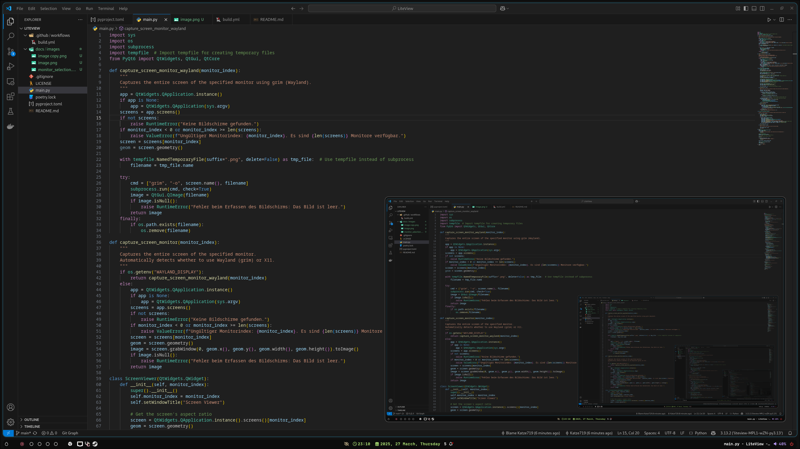

# 🌟 LiteView

Inspired by the need for a simple, cross-platform screen viewer.

LiteView is a lightweight screen viewer application built with Python and PyQt6. It allows you to preview and select monitors, and dynamically view their content in real-time. 🚀

## ✨ Features

- 🖥️ **Multi-Monitor Support**: Preview all available monitors and select one to view.
- 📏 **Dynamic Resizing**: Maintains aspect ratio while resizing the window.
- ⚡ **Real-Time Updates**: Refreshes the screen content at ~66 FPS.
- 🐧 **Wayland and X11 Support**: Automatically detects and supports both display protocols.
- 🛠️ **Cross-Platform**: Build and run on both Linux and Windows.

## 📦 Installation

1. Clone the repository:
   ```bash
   git clone https://github.com/Katze719/LiteView.git
   cd LiteView
   ```

2. Install dependencies:
   ```bash
   pip install -r requirements.txt
   ```

3. Run the application:
   ```bash
   python main.py
   ```

## 🛠️ Building the Application

LiteView can be built into standalone executables for Linux and Windows using `PyInstaller`.

### Build for Linux:
```bash
pyinstaller --onefile --noconsole main.py
```

### Build for Windows:
```bash
pyinstaller --onefile --noconsole main.py
```

Alternatively, use the provided GitHub Actions workflow to automate the build process.

## 🚀 Usage

1. Run the application:
   ```bash
   python main.py
   ```

2. A preview of all available monitors will be displayed. Click on the monitor you want to view.

3. The selected monitor's content will be displayed in a dynamically resizable window.

## 🖼️ Screenshots

### Monitor Selection


### Real-Time Viewer


## 🛡️ Requirements

- Python 3.10 or higher
- PyQt6
- `grim` (for Wayland support on Linux)

## 🤝 Contributing

Contributions are welcome! Feel free to open issues or submit pull requests. 💡

## 📄 License

This project is licensed under the GPL-3.0 License. See the [LICENSE](LICENSE) file for details.